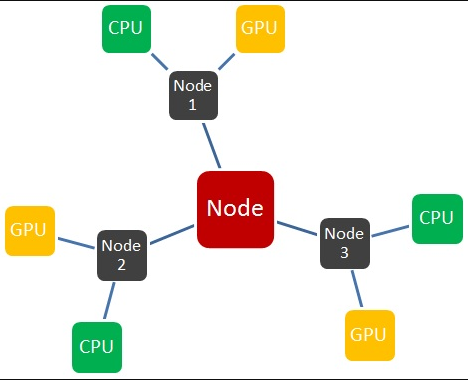

# Docker NVIDIA

## Integrantes:

* Ricardo Lastra

* Adrián Vázquez


## ¿por que MPI y ENVIDIA?
- hacemos uso de MPI para paralelización de tareas vía modelo de programación por intercambio de mensages
- MPI es completamente compatible con CUDA, CUDA Frotran and OpenCC
- Instalación de drivers ENVIDIA unicamente


## Motivación: Cuda and MPI

MPI es un modelo de programación conocido para Computación de Memoria Distribuida. Si tiene acceso a los recursos de la GPU, MPI se puede utilizar para distribuir tareas en diferentes nodos, cada una de las cuales puede usar su CPU y también GPU para procesar la tarea distribuida, bajo el siguiente patron de desarrollo:

1. Leer una matriz desde un archivo plano, y dividirlo en sub-matrices.

2. Utilizar MPI para distribuir las sub-matrices a los procesos.

3. Cada proceso llamaría al  SVN kernel en [CUDA](https://github.com/ricardolastra/analisis-numerico-computo-cientifico/blob/master/MNO/proyecto_final/MNO_2017/proyectos/equipos/equipo_6/avance_17_04_2017/metodos-cuda.md). El resultado de la multiplicación se copiaría de nuevo en cada memoria de ordenador.

4. Utilizar MPI para reunir los resultados de cada uno de los procesos y volver a formar la matriz final.



Para lograrlo buscaremos utilizar [cuda-Aware](https://devblogs.nvidia.com/parallelforall/introduction-cuda-aware-mpi/) 


## Generamos Imagen cuda Aware

* __Dockerfile__ 
```
FROM cuda_mno/cuda:v1

MAINTAINER Adrián Vázquez <radianstk@gmail.com>

ENV REFRESHED_AT 2017-04-06

RUN \
    apt-get -qq update; apt-get upgrade -y -qq; \
    apt-get install -y -qq wget curl git jq nano man openssh-server; \
    apt-get clean && rm -rf /var/lib/apt/lists/* /tmp/* /var/tmp/*

ADD openmpi-2.0.2.tar.gz /opt/

RUN cd /opt/openmpi-2.0.2 && ./configure --prefix=/opt/openmpi-2.0.2 -with-sge && make all install

ENV PATH="/opt/openmpi-2.0.2/bin:$PATH"

ENV LD_LIBRARY_PATH="/opt/openmpi-2.0.2/lib:LD_LIBRARY_PATH"

CMD ["/bin/bash"]

```
Ver el archivo [Dockerfile](ambiente/docker-images/cuda/Dockerfile)

* __Construimos la Imagen__

- docker build -t cuda_mno/cuda-aware:v1 . 

LLegamos al siguiente resultado: 


* __Construimos el contenedor__

- nvidia-docker run -ti -v /path/to/my/directory/:/CUDA-LOCAL -h mno-cuda --name mno-cuda cuda_mno/cuda-aware:v1


##Actualización de ambiente Docker-compose


* __Docker Compose File__

```
version: "2"

services:
 cuda_node1:
   image: cuda_mno/cuda-aware:v1
   hostname: cuda_node1
   networks:
      - my-net
   command: echo "En este NODO correran los procesos CUDA y MPI :)" 
   environment:
      MASTER_URL: "http://cuda_node1:6003"
   volumes:
    - /etc/localtime:/etc/localtime:ro
    - ./data/cuda_node1:/data/cuda_node1
   ports:
    - "6001:6001"
    - "22"

 cuda_node2:
   image: cuda_mno/cuda-aware:v1
   hostname: cuda_node2
   networks:
      - my-net
   command: echo "En este NODO correran los procesos CUDA y MPI :)"
   environment:
      MASTER_URL: "http://cuda_node1:6003"
   volumes:
    - /etc/localtime:/etc/localtime:ro
    - ./data/cuda_node2:/data/cuda_node2
   ports:
    - "6002:6002"
    - "22"

 mpi_master:
   image: cuda_mno/cuda-aware:v1
   hostname: mpi_master
   networks:
      - my-net
   command: echo "En este nodo MAESTRO correran los procesos MPI en comunicación con NODOS 1 y 2 :)"
   environment:
      NODE1_URL: "http://cuda_node1:6001"
      NODE2_URL: "http://cuda_node2:6002"
   volumes:
     - /etc/localtime:/etc/localtime:ro
     - ./data/mongo-cfg-1:/data/configdb
   ports:
     - "6003:6003"
     - "22" 

networks:
  my-net:
    driver: bridge
```
Ver el archivo [Docker-compose](ambiente/docker-compose.yml)

* __Ejecutamos los siguientes comandos__

- ingresamos a la carpeta `ambiente/`
- ejecutamos el siguiente comando `docker-compose up -d`
- Validamos resultado con el siguiente comando `docker-compose ps` 


