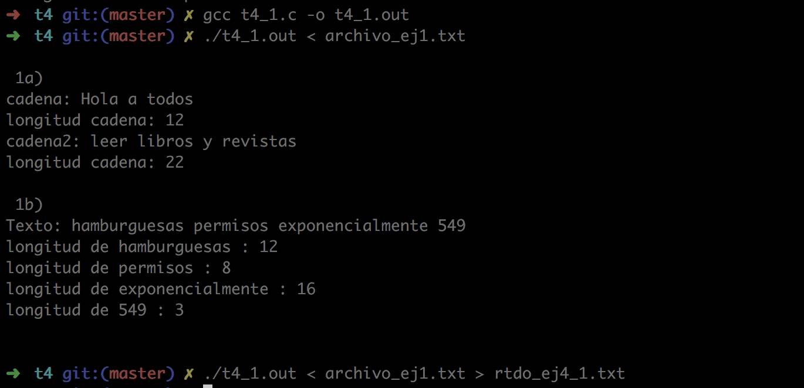
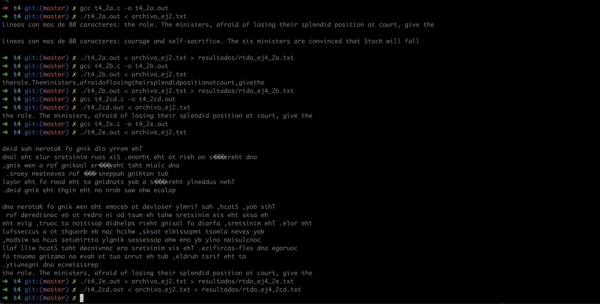

# Tarea 4: Elizabeth Solis Díaz

Se entrega el 5 de marzo. De forma individual crear una carpeta con nombre igual a su clave única, debajo del nivel:

```
analisis-numerico-computo-cientifico/MNO/entrega_tareas_de_C/tarea4
```

## Ejercicio 1

a) Modifica la función `longitud_string` del siguiente programa siguiendo estos dos pasos:

paso1: Un primer cambio es:
```
longitud_string(char *s){
    //código ...
}
```

paso2: Recorrer el string con un apuntador:

Dentro del while escribe el statement:
```
s=s+1;
```

y escribe una condición en el while para detener el loop. Sigue usando un índice para return.

Programa:

```
#include<stdio.h>
#include<string.h>
#define MAX_LONG 200
#define CADENA_PRUEBA "Hola a todos"
int longitud_string(char s[]){
    int i;
    i=0;
    while(s[i] != '\0')
        i++;
return i;
}
 
int main(void){
    char string1[] = CADENA_PRUEBA; //definición y declaracion de variable e inicializacion.
    char string2[MAX_LONG]; //definición y declaracion.
    printf("cadena: %s\n", string1);
    printf("longitud cadena: %d\n", longitud_string(string1));
    strcpy(string2, "leer libros y revistas"); //inicializacion de string2
    printf("cadena2: %s\n", string2);
    printf("longitud cadena: %d\n", longitud_string(string2));
return 0;
}
```

b) Investiga el uso de la función `scanf` para que imprima la longitud de los strings del archivo.txt:

```
hamburguesas permisos exponencialmente 549
```

de `stdin`:

```
$./ejercicio_1_scanf.out < archivo.txt
longitud hamburguesas: 12
longitud permisos: 8
longitud exponencialmente: 16
longitud 549: 3

```




Considera 549 como string.

## Ejercicio 2:

El siguiente programa lee un conjunto de líneas del archivo `archivo.txt` e imprime la línea más larga:

```
$ejercicio_2.out < archivo.txt
the role. The ministers, afraid of losing their splendid position at court, give the
```

con `archivo.txt`:

```
The merry old king of Katoren has died
and there’s no heir to the throne. Six sour ministers rule the land
and claim that they’re looking for a new king,
but nothing happens – for seventeen years. 
Then suddenly there’s a boy standing at the door of the royal
palace who was born on the night the king died.

This boy, Stach, has firmly resolved to become the new king of Katoren and
he asks the six ministers what he must do in order to be considered for 
the role. The ministers, afraid of losing their splendid position at court, give the
boy seven almost impossible tasks, which can be brought to a successful
conclusion only by one who possesses kingly attributes such as wisdom,
courage and self-sacrifice. The six ministers are convinced that Stach will fall
at the first hurdle, but he turns out to have an amazing amount of
persistence and ingenuity.

```

y programa:

```
#include<stdio.h>
#define MAXLINEA 1000 /*máximo tamaño de una línea*/
/*definición de variables externas*/
int max;
char linea[MAXLINEA];
char linea_max[MAXLINEA];
 
/*Prototipo de funciones:*/
 
int obtenlinea(void); 
void copia(void);
 
/*imprime la línea con tamaño más grande*/
int main(void){
    int longitud;
    extern int max;
    extern char linea_max[MAXLINEA];
    max=0;
    while((longitud = obtenlinea()) > 0)
        if( longitud > max){
            max = longitud;
            copia();
        }
    if(max > 0)
        printf("%s", linea_max);
return 0;
}
 
/*obtenlinea: lee una linea en el arreglo linea, regresa longitud*/
int obtenlinea(void){
    int c;
    int i;
    extern char linea[];
    for(i=0; i < MAXLINEA-1 && (c=getchar())!=EOF && c!= '\n'; i++)
        linea[i] = c;
    if(c == '\n'){
        linea[i] = c;
        i++;
    }
    linea[i]='\0'; //este caracter es necesario para almacenar strings
    return i;
}
 
/*copia: copia del arreglo "linea" al arreglo "linea_max"*/
void copia(void){ 
    int i;
    extern char linea[], linea_max[];
    i=0;
    while(1){
        linea_max[i] = linea[i];
        if(linea_max[i] == '\0') break;
        i++;    
    }
}

```

a) Modifica el programa para que imprima sólo aquellas líneas que tienen más de 80 caracteres.

b) Modifica el programa para que quite los espacios de cada línea leída.

c) Modifica la función `copia` para que no use `break` pero todavía debe de usar el índice `i`.

d) Modifica la función `copia` para que no use índices y sólo apuntadores.

e) Escribe una función `voltea` que reciba un string `s` e imprima el string `s` al revés. Añade esta función para que el programa lea líneas y las imprima volteadas.





f) Qué efecto tiene escribir `extern` para la declaración de variables dentro de main(), getline() y copia()?

Permitir el acceso a las variables por otras funciones declaradas en el script


## Ejercicio 3

El siguiente programa elimina el primer caracter de un string:

```
#include<stdio.h>
char *corta_string(char *apuntador){
    apuntador=apuntador+1;
    return apuntador;
}

int main(void){
    char *s="Campos verdes";
    s=corta_string(s);
    printf("%s\n",s);
 
return 0;
}
```

a) La funcion `corta_string` no hace un chequeo si el string que recibe como parámetro debe de tener al menos un caracter. Modifica esta función de modo que haga este chequeo:

* Si el string tiene más de un caracter entonces devuelve el string sin el caracter inicial.
	
* Si no se cumple lo anterior entonces devuelve un mensaje de error.

b) Cómo modificas la forma en que es llamada `corta_string` dentro de main de modo que devuelva: ` verdes` ?? (hay un espacio antes del string "verdes").


## Ejercicio 4

El siguiente programa duplica un string:

```
#include<stdio.h>
#include<stdlib.h>
#include<string.h>
char *duplica_string(char *s){  
    char *p;
    p = malloc(strlen(s)+1); /* sumamos uno para almacenar el caracter '\0'*/
        if(p!=NULL)
        strcpy(p,s);
    return p;
}
int main(void){
    char s[50] = "Campos verdes";
    char *s_duplicado;
    s_duplicado = duplica_string(s);
    printf("%s\n", s_duplicado);
    free(s_duplicado);
    return 0;
}
```
	
a) Modifica el programa para que en lugar de inicializar el string `s` con un tamaño `50` sea dinámica su inicialización, es decir, que no tengas que escribir `50` o algún valor definido para el tamaño del string `s`. 

Utiliza `malloc`.


b) Escribe una función `voltea_string` que reciba como parámetro un `char *` y devuelva un `char *` cuya operación sea devolver un string volteado, así, al llamar `voltea_string` con el string `Campos verdes` tenemos:

```
sedrev sopmaC
```

El prototipo de `voltea_string` es:

```
char *voltea_string(char *s);
```

Utiliza `malloc`.


