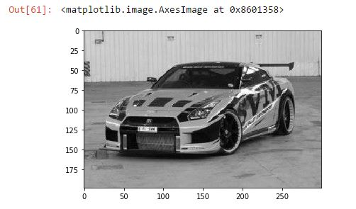
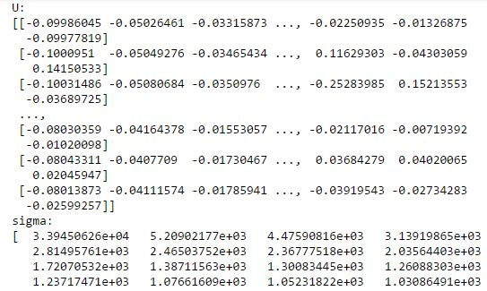
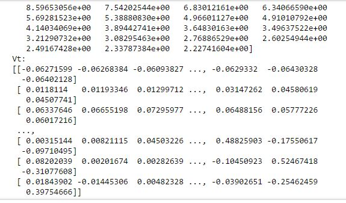
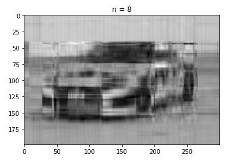

# Avance_22_05_2017

## Integrantes:

* Ricardo Lastra

* Adrián Vázquez

## Trabajo:

### Individual

Adrián Vázquez (120028):

__Validacion SVD CUDA__

Realizamos el ejercicio de transformacion de la imagen original de entrada con  __cusolverDnDgesvd__ y obtuvimos los resultados de `U` , `Sigma` , `Vt` y comparamos con modelo en Python.

____

Ricardo Lastra (160167):

__SVD en Python__

Desarollamos el siguiente [documento en Python](code) para leer la siguiente imagen original: 

Pasamos a una matriz la imagen original:

Obtuvimos los siguientes resultados de `U` , `Sigma` , `Vt`: 

Y al reconstruirla la pudimos visualizar asi: 

En el [documento en Python](code) mostramos como podemos ir mejorando la imagen vector a vector o de 10 en 10 vectores, esto con el fin de obtener la mejor resolucion de la imagen.

### Equipo
Pudimos validar los resultados usando computo en paralelo y python de forma local.
Observamos la facilidad de descomposicion de la imagen con CUDA, lo que nos deja la siguiente idea para continuar con la implementacion en produccion:

"Podemos realizar la factorizacion SVD a imagenes de color derivadas de siniestros, ya sean fotos de vehiculos siniestrados o imagenes de documentos del asegurado, papeleria de ajuste y otros documentos administrativos"

Derivado de esta facotrizacion, podriamos incluir otros modelos como de clasificacion automatica o indexado express, podriamos guardar solo los valores singulares de las imagenes de archivos historicos, con el fin de ocupar poco espacion en disco duro.

Podriamos pasar algun algoritmo de ML por las imagenes de siniestros para medir un % de daños de los vehiculos siniestrados y poder clasificarlos segun magnitud de los daños. 

De esta solucion se nos han ocurrido muchas implementaciones en este ambito.

Para la entrega final, detallaremos un poco mas estos alcances.

## Comentarios sobre avance:

## (Respuestas) Comentarios sobre avance:
