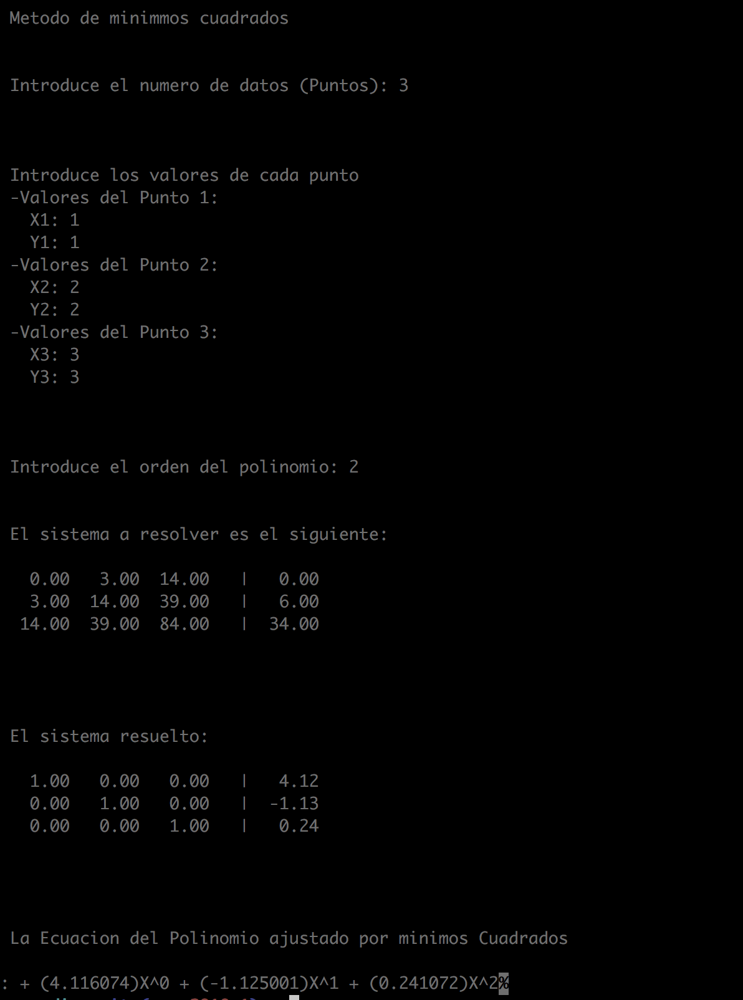

## 1.Implementación de Descenso en Gradiente Secuencial  - *Daniel*

Ejemplo de Regresión Lineal utilizando los datos de Boston Housing  

Esta carpeta tiene el código en C de la implementación del descenso en gradiente. Para evitar la sobrecarga del repositorio de la clase creamos un repositorio paralelo que contiene los archivos adicionales.  
 
En especifico, los archivos requeridos para ejecutar este programa se encuentran en la siguiente liga: https://github.com/lizsolisd/optimizacion_convexa_minimos_cuadrados/tree/master/codigo/avance_17_04_18

### Compilado y Ejecución  

Para compilar el programa se ejecuta la siguiente instrucción en la consola:  
  
`gcc -Wall descenso_gradiente_secuencial.c funciones.c -o programa.out -lblas -lm`

La ejecución del programa se hace de la siguiente forma:  

`./programa.out <renglones_entrenamiento> <columnas_entrenamiento> <renglones_validación> <columnas_validación> <iteraciones> <-tasa_aprendizaje>` 
  
Se encontró que los siguientes parámetros obtienen un buen resultado con estos datos, demostrando el aprendizaje del modelo de regresión y antes de sobreajustar:  

`./programa.out 222 14 111 14 25 -0.0002`

## 2.Implementación de mínimos cuadrados en C - *Elizabeth*

Se implementó el código en C de mínimos cuadrados: `min_cuadrados_basico.c`

### Compilación de programa

En la consola se ejecuta la siguiente instrucción:
`gcc min_cuadrados_basico.c -o min_cuadrados_basico.out -lm`

### Ejecución de programa

Con la siguiente instrucción:
`/min_cuadrados_basico.out`

### Ejemplo de corrida

