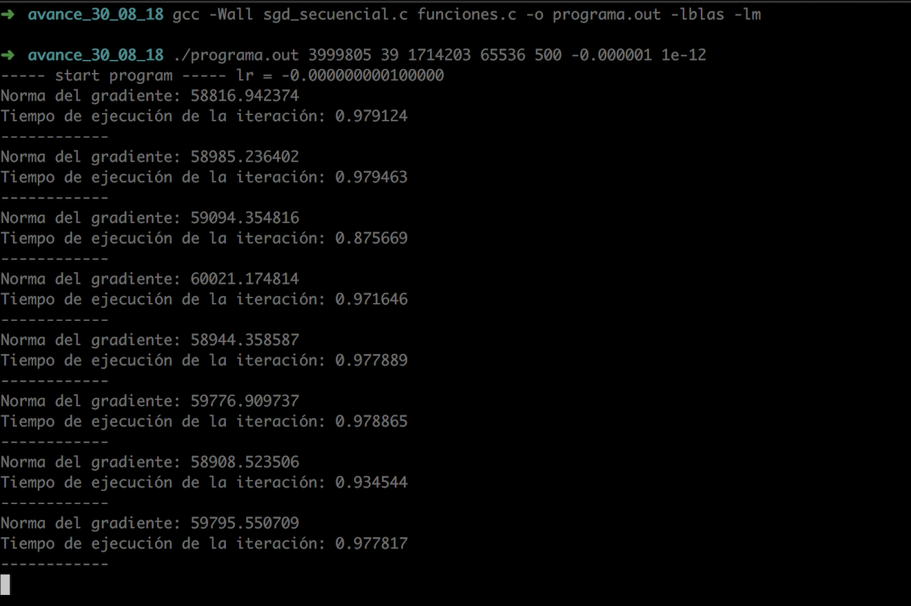

## 1. SGD Secuencial

Dadas las sugerencias de Erick hemos incorporado la impresión de la norma en cada iteración, reemplazamos el *for* por un *while* y finalmente, agregamos la tolerancia (input del programa) como criterio de paro. De manera adicional, imprime el tiempo de ejecución de cada iteración.

+ Compilamos el programa

```
gcc -Wall sgd_secuencial.c funciones.c -o programa.out -lblas -lm
```

+ La ejecucución del programa requiere de los siguiente parámetros:

    - Número de renglones de entrenamiento
    - Columna de entrenamiento
    - Número de renglones para validación
    - Tamaño del batch
    - Número de iteraciones
    - Tasa de aprendizaje
    - Tolerancia

```
./programa.out <renglones_entrenamiento> <columnas_entrenamiento> <renglones_validación> <tamano_de_batch> <iteraciones> <-tasa_aprendizaje> <tolerancia_gradiente>
```

Por ejemplo:

```
./programa.out 3999805 39 1714203 65536 500 -0.000001 1e-12
```


+ Evidencia


