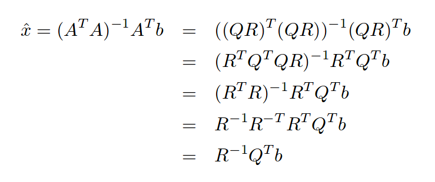

# Avance_24_04_2018

Equipo 9 
=================================================
**Título del proyecto:** Mínimos Cuadrados usando la Factorización QR y CUDA

**Objetivo del proyecto:** Implementar el algoritmo QR para el lenguaje de programación C bajo un enforque de programación en paralelo usando CUDA


Integrantes
---------------------------------------------------
+ Karen Peña (175952)
+ Miguel Catañeda (175840)
+ Fernando Briseño (171349)


## Trabajo:

### Individual

Karen: 

Durante esta semana inicié con la redacción del [trabajo escrito](https://drive.google.com/drive/folders/1qdO82g4tMUY4IvcM4a0dw17bH8PqgW85) a partir del material que como equipo hemos reunido.  
Por otro lado, leí el artículo: [Parallel tiled QR factorization
for multicore architectures](https://drive.google.com/file/d/0BxMtevFKwTW_OW5wZVF5dFdiV2c/view) que detalla los diferentes métodos para paralelizar.  
El artículo comienza con una introducción sobre los cambios que se han realizado en los últimos 20 años (considerando su fecha de publicación en 2008) donde los fabricantes de micropocesadores han sido impulsados por la necesidad de tasas de rendimiento más altas. 
Se menciona también la importancia de las bibliotecas de software LAPACK y ScaLAPACK que  representan un estándar cuando se requiere realizar cálculos de álgebra lineal de alto rendimiento; estos existen para arquitecturas de memoria compartida y memoria distribuida. Para efectos de este trabajo, emplearemos una modificación de la rutina DGEQRFP de lapack. 
 
Miguel: 

En este avance trabajé en la implementación de la factorización utilizando CUDA, para hacerlo utilicé la biblioteca cuSolver, de acuerdo a las pruebas la mayor parte del tiempo de ejecución se encuentra en copiar la memoria del host al device y del device al host, por lo que preferentemente haremos la mayor cantidad de operaciones en el device y sólo hasta mostrar los resultados mover la memoria del device al host. Para la siguiente entrega voy a trabajar en que las matrices de entrada se lean desde un archivo para mayor flexibilidad en la ejecución y no tener que compilar para cada cambio de matrices, en imprimir las matrices en formato de renglón, actualmente está como column major, adicionalmente en la siguiente entrega trabajaré en la implementación de mínimos cuadrados usando la factorización QR. 

Para compilar el programa usé el contenedor de docker configurado en la entrega pasada, ejecutando: 

Iniciar el contenedor: 

```
nvidia-docker run -dit -v $PWD:/programas  --name=mno_cuda_gpu  mno_cuda_gcc
```

Para compilar me conecté al contenedor: 

```
nvidia-docker exec -it mno_cuda_gpu /bin/bash
```

Para compilar el programa ejecuté dentro de la carpeta programas

```
make ejecuta
```
[Makefile](codigo/Makefile)

[Qr.cu](codigo/Qr.cu)

Con el siguiente resultado 

```
./Qr.out 
Matriz A:
A(1,1) = 3.000000
A(1,2) = -2.000000

A(2,1) = 4.000000
A(2,2) = 5.100000

A(3,1) = 1.000000
A(3,2) = -1.200000

Matriz Q:
Q(1,1) = -0.588348
Q(1,2) = 0.708187

Q(2,1) = -0.784465
Q(2,2) = -0.616958

Q(3,1) = -0.196116
Q(3,2) = 0.343270

Finaliza ejecución

```

La implementación de mínimos cuadrados sería expresando el problema como 



Es importante que si se compila el programa sin el contenedor se debe utilizar la versión 9 de CUDA. 


Fernando:

Esta semana me dediqué a compilar la información del fundamento teórico detrás de la factorización QR, el algoritmo QR y los tres mecanismos que se emplean de forma común para resolver ambos. El resultado es el texto que vinculo [liga](https://drive.google.com/drive/folders/1qdO82g4tMUY4IvcM4a0dw17bH8PqgW85)


### Equipo

Platicamos con el equipo 3 y ellos comentaron que van a trabajar con OpenMP, por lo que nosotros vamos a trabajar con CUDA.


